# POLARIS Architecture

**Policy Optimization via Layered Agents and Recursive Inference Search**

## Table of Contents

- [Overview](#overview)
- [Core Principles](#core-principles)
- [System Architecture](#system-architecture)
- [Component Hierarchy](#component-hierarchy)
- [Data Flow](#data-flow)
- [Agent System](#agent-system)
- [Sentinel Oversight](#sentinel-oversight)
- [Domain System](#domain-system)
- [Search Process](#search-process)
- [Design Patterns](#design-patterns)

---

## Overview

POLARIS is a multi-agent decision-making framework that extends Monte Carlo Tree Search (MCTS) with three revolutionary concepts:

1. **Agent-Agnostic Architecture**: Works with any evaluation agent (LLMs, heuristics, neural networks)
2. **Cognitive Layering**: Implements Kahneman's dual-process theory with multiple reasoning layers
3. **Sentinel Oversight**: Meta-cognitive agent that detects bias and ensures diversity

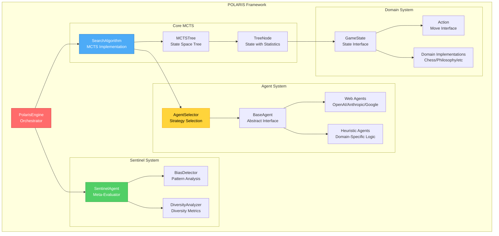

---

## Core Principles

### 1. Layered Cognitive Reasoning

Inspired by Daniel Kahneman's "Thinking, Fast and Slow", POLARIS organizes decision-making in hierarchical layers:

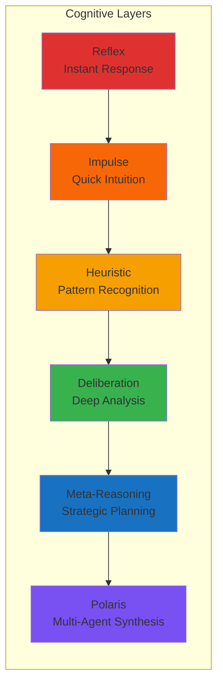

### 2. Agent-Agnostic Design

POLARIS doesn't care about the implementation details of agents. Any system that can evaluate a state is valid:

- **Large Language Models** (GPT-4, Claude, Gemini)
- **Neural Networks** (AlphaZero-style networks)
- **Heuristic Functions** (Hand-crafted evaluation)
- **Hybrid Systems** (Combining multiple approaches)

### 3. Sentinel Oversight

Unlike traditional MCTS, POLARIS includes a **Sentinel Agent** that monitors the search process:

- Detects systematic, temporal, positional, and confirmation biases
- Analyzes evaluation diversity and groupthink
- Applies corrective adjustments to maintain search quality
- Provides transparency through intervention statistics

---

## System Architecture

### High-Level Component View

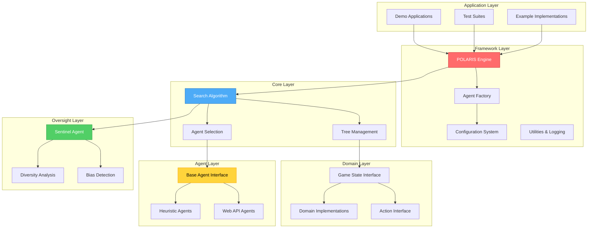

---

## Component Hierarchy

### POLARIS Engine (Orchestrator)

The main entry point that coordinates all framework components.

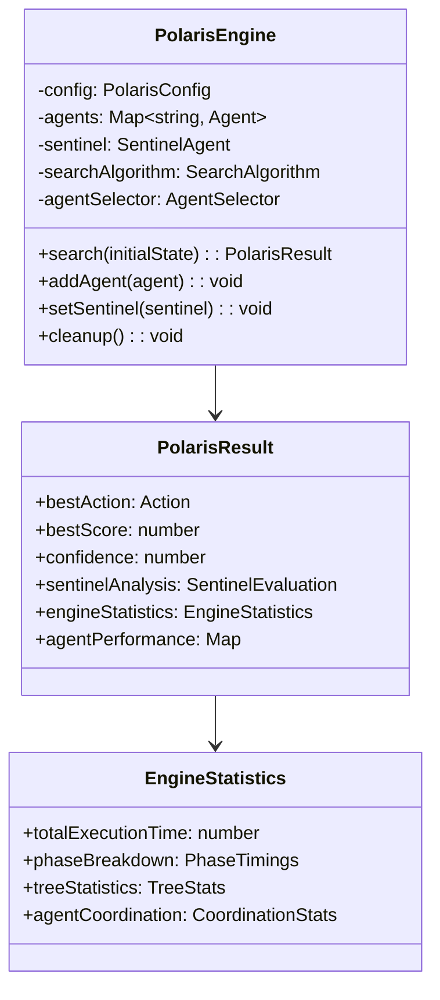

### Search Algorithm (Core MCTS)

Implements the Monte Carlo Tree Search with agent diversity.

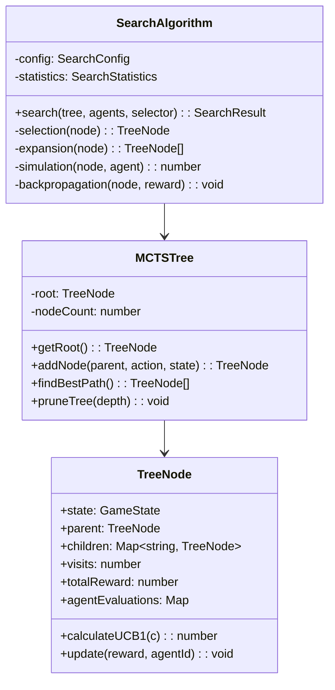

---

## Data Flow

### MCTS Iteration Flow

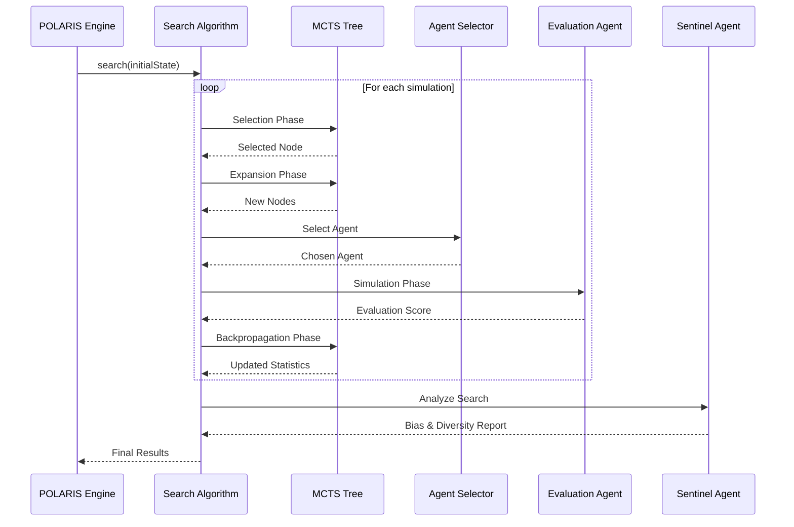

### Evaluation Flow with Sentinel

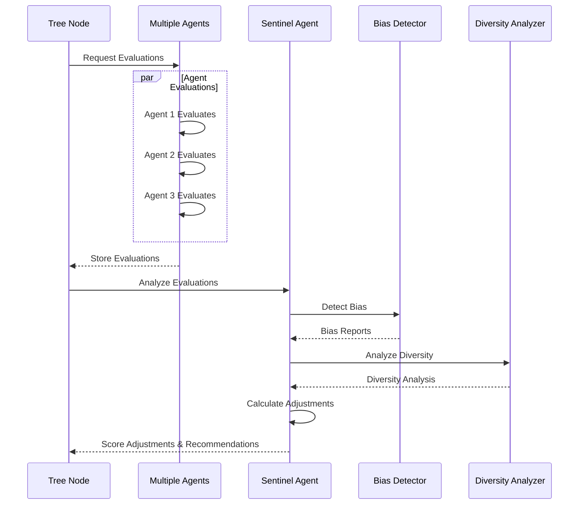

---

## Agent System

### Agent Hierarchy

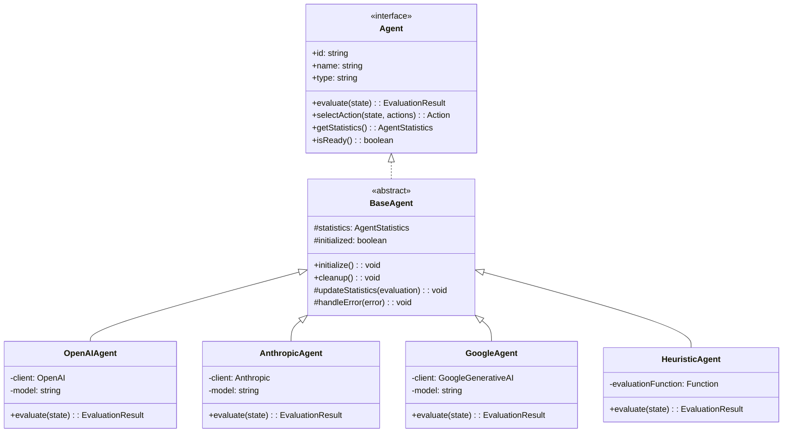

### Agent Selection Strategies

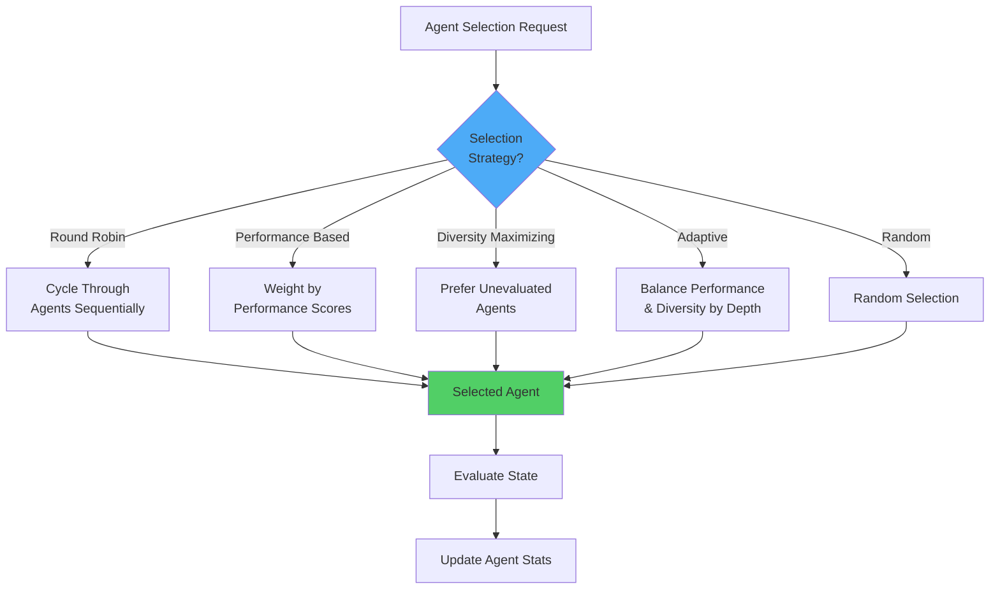

---

## Sentinel Oversight

### Sentinel Agent Architecture

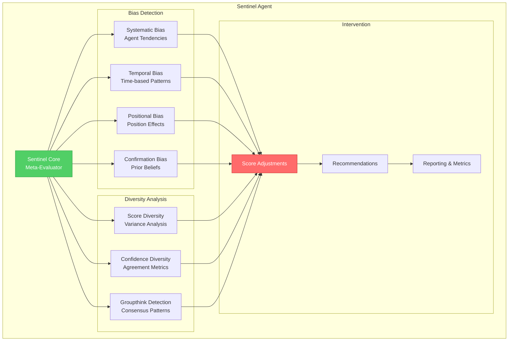

### Bias Detection Pipeline

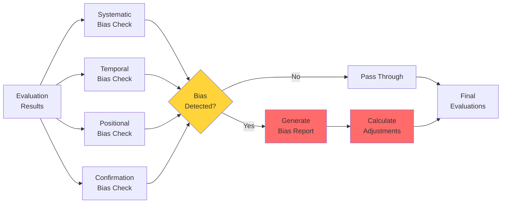

---

## Domain System

### Domain Interface Structure

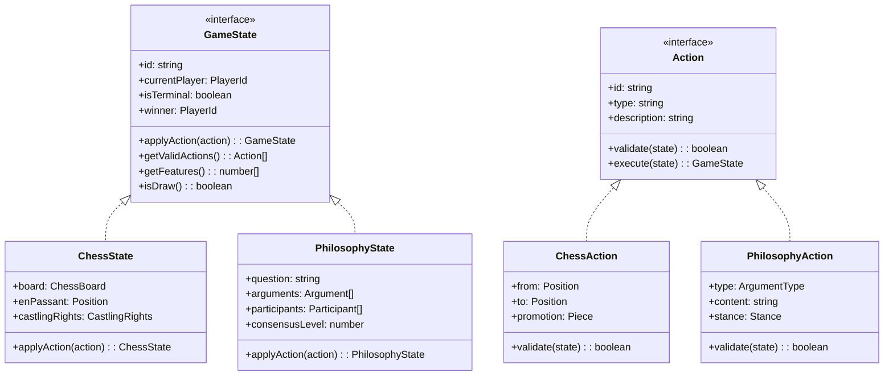

### Domain-Agnostic Design

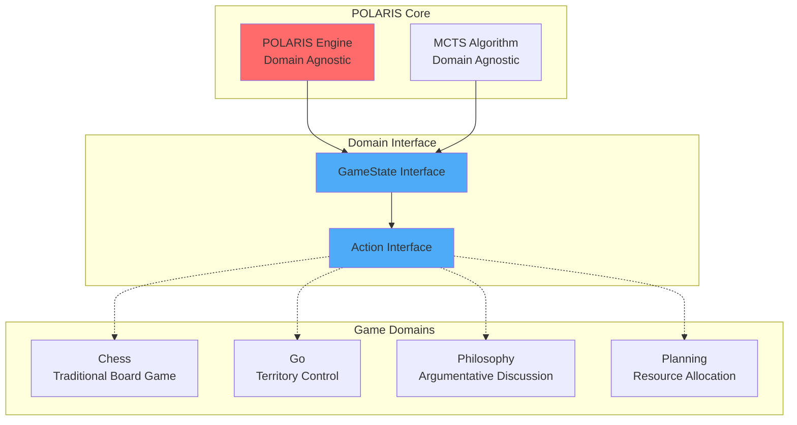

---

## Search Process

### Complete MCTS Cycle

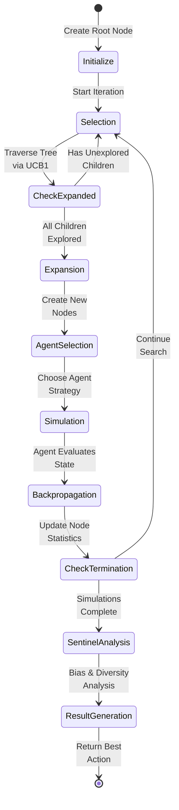

### UCB1 Calculation Flow

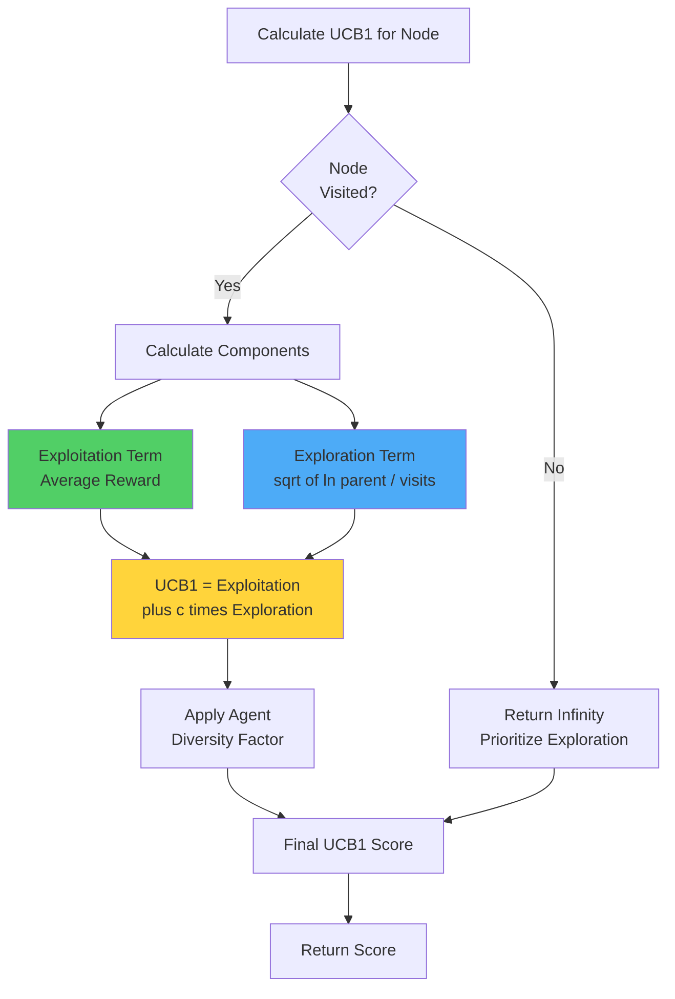

---

## Design Patterns

### 1. Strategy Pattern (Agent Selection)

Different strategies for selecting which agent to use:

- **Round Robin**: Fair distribution
- **Performance-Based**: Weighted by quality
- **Diversity-Maximizing**: Avoid redundancy
- **Adaptive**: Context-dependent selection

### 2. Observer Pattern (Sentinel System)

The Sentinel observes evaluations and intervenes when necessary:

- Monitors all agent evaluations
- Detects patterns and anomalies
- Provides feedback without blocking
- Maintains history for trend analysis

### 3. Template Method Pattern (Agent Base)

Common agent lifecycle with customizable evaluation:

```typescript
abstract class BaseAgent {
  async evaluate(state: GameState): EvaluationResult {
    // Template method with hooks
    this.beforeEvaluate();
    const result = await this.doEvaluate(state); // Abstract
    this.afterEvaluate(result);
    return result;
  }

  protected abstract doEvaluate(state: GameState): EvaluationResult;
}
```

### 4. Builder Pattern (Configuration)

Fluent configuration building:

```typescript
const config = new ConfigBuilder()
  .withSearch({ simulationsPerNode: 1000 })
  .withSentinel({ diversityThreshold: 0.7 })
  .withAgents([agent1, agent2, agent3])
  .build();
```

### 5. Factory Pattern (Agent Creation)

Centralized agent instantiation:

```typescript
const agent = AgentFactory.create("openai", {
  apiKey: process.env.OPENAI_API_KEY,
  model: "gpt-4",
});
```

---

## Key Features

### 1. Multi-Agent Diversity

- **Parallel Reasoning**: Multiple agents evaluate simultaneously
- **Bias Mitigation**: Diverse perspectives reduce systematic errors
- **Consensus Building**: Aggregated opinions improve reliability

### 2. Meta-Cognitive Oversight

- **Bias Detection**: Identifies systematic evaluation patterns
- **Diversity Analysis**: Measures evaluation variance
- **Corrective Intervention**: Adjusts scores to maintain quality

### 3. Domain Flexibility

- **Game AI**: Chess, Go, strategic games
- **Planning**: Resource allocation, scheduling
- **Discussion**: Philosophical debates, consensus-building
- **Research**: Multi-perspective analysis

### 4. Production-Ready Features

- **Error Handling**: Graceful degradation and recovery
- **Performance Monitoring**: Detailed statistics and profiling
- **Memory Management**: Tree pruning and resource limits
- **Logging & Debugging**: Comprehensive instrumentation

---

## Performance Characteristics

### Complexity Analysis

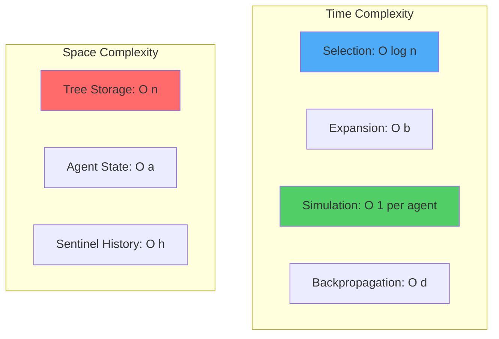

- **n**: Number of nodes in tree
- **b**: Branching factor (actions per state)
- **d**: Depth of tree
- **a**: Number of agents
- **h**: History size for sentinel### Scalability Factors

1. **Horizontal Scaling**: Multiple agents can evaluate in parallel
2. **Vertical Scaling**: Tree pruning and progressive widening
3. **Time Management**: Early termination and time limits
4. **Memory Management**: Automatic pruning under pressure

---

## Future Extensions

### Planned Features

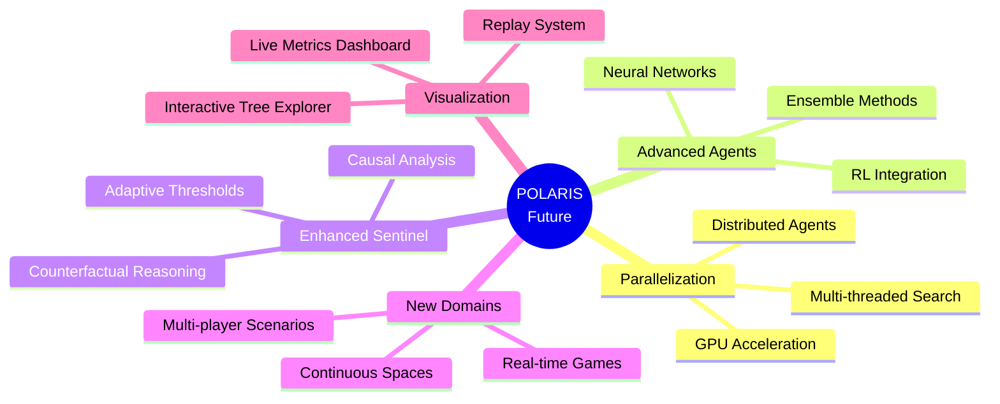

---

## Conclusion

POLARIS represents a novel approach to decision-making that:

1. **Embraces Diversity**: Multiple agents with different biases create robust evaluations
2. **Provides Oversight**: Sentinel system ensures quality and transparency
3. **Enables Flexibility**: Domain-agnostic design works across problem spaces
4. **Scales Effectively**: Production-ready features support real-world applications

The framework is built on solid software engineering principles while implementing cutting-edge AI research concepts, making it both practical and innovative.

---

## References

- Kahneman, D. (2011). _Thinking, Fast and Slow_
- Browne, C. et al. (2012). "A Survey of Monte Carlo Tree Search Methods"
- Silver, D. et al. (2017). "Mastering Chess and Shogi by Self-Play with a General Reinforcement Learning Algorithm"

---

_For more information, see [README.md](README.md) and [PHILOSOPHY_DEMO.md](PHILOSOPHY_DEMO.md)_
