# POLARIS Architecture

**Policy Optimization via Layered Agents and Recursive Inference Search**

## Table of Contents

- [Overview](#overview)
- [Dual-Mode Design](#dual-mode-design)
- [Flat Inference Mode](#flat-inference-mode)
- [Pipeline Mode (Polaris Creativa)](#pipeline-mode-polaris-creativa)
- [Agent System](#agent-system)
- [Strategy Pattern](#strategy-pattern)
- [Sentinel Oversight](#sentinel-oversight)
- [Domain System](#domain-system)
- [Project Structure](#project-structure)

---

## Overview

POLARIS is a multi-agent decision-making framework with two execution modes:

1. **Flat Inference** — parallel multi-agent evaluation with role-aware prompts
2. **Pipeline (Polaris Creativa)** — 4-layer creative pipeline with decay-based reinjection

Both modes share the same agent system, task definitions, and output format.

```
┌─────────────────────────────────────────────────┐
│                  PolarisEngine                   │
│                                                  │
│   mode: "flat"           mode: "pipeline"        │
│   ┌──────────┐           ┌──────────────────┐   │
│   │ Parallel │           │  LayerPipeline   │   │
│   │ Agents   │           │  (4-layer loop)  │   │
│   └──────────┘           └──────────────────┘   │
│         │                        │               │
│         └────────┬───────────────┘               │
│                  ▼                                │
│            EngineOutput                           │
└─────────────────────────────────────────────────┘
```

## Dual-Mode Design

`PolarisEngine` is the single entry point. The `mode` field in config selects the execution path:

```typescript
// Flat mode (default) — parallel multi-agent inference
const engine = new PolarisEngine({ task, agents, mode: "flat" });

// Pipeline mode — 4-layer creative pipeline
const engine = new PolarisEngine({
  task,
  agents,
  mode: "pipeline",
  pipelineConfig: { decayConfig, divergentAgents, ... }
});
```

Both modes return `EngineOutput` with the same shape. Pipeline mode attaches additional metadata (`pipelineResult`) for iteration tracking.

---

## Flat Inference Mode

The original execution path. All agents evaluate the same state in parallel and return independent outputs.

```
State + Actions
       │
       ▼
  ┌─────────┐
  │ Agent 1  │──┐
  │ Agent 2  │──┤── All run in parallel
  │ Agent N  │──┘
  └─────────┘
       │
       ▼
  EngineOutput (array of AgentOutput)
```

Key characteristics:
- Agents are **role-aware** — prompts built automatically from `AgentRole` and `PolarisEngineTask`
- Supports OpenAI, Anthropic, and Google providers
- No inter-agent communication
- Single-pass evaluation

---

## Pipeline Mode (Polaris Creativa)

A 4-layer creative pipeline with decay-based quality loop.

```
                    ┌──────────────────────────────────────┐
                    │           DECAY LOOP                  │
                    │                                       │
 ┌──────────┐      │  ┌────────────┐    ┌──────────────┐  │
 │ Layer 1   │──────┼─▶│  Layer 2   │───▶│   Layer 3    │  │
 │ Divergent │      │  │ Inquisitor │    │ Synthesizer  │  │
 │ T=0.8-1.0 │      │  │ T=0.1-0.3  │    │  T=0.3-0.5   │  │
 │ (parallel)│      │  │ (filter)   │    │  (weave)     │  │
 └──────────┘      │  └────────────┘    └──────┬───────┘  │
                    │                           │          │
                    │                    ┌──────▼───────┐  │
                    │                    │   Layer 4    │  │
                    │                    │ Orchestrator │  │
                    │                    │  T=0.1       │  │
                    │                    │ (quality gate)│  │
                    │                    └──────┬───────┘  │
                    │                           │          │
                    │              ┌─────────────┤          │
                    │              │  deliver?   │          │
                    │              │  or rerun?  │          │
                    │              ▼             ▼          │
                    │           OUTPUT     REINJECTION ─────┘
                    └──────────────────────────────────────┘
```

### Layer Descriptions

| Layer | Name | Temperature | Purpose |
|-------|------|-------------|---------|
| 1 | **Divergent** | 0.8–1.0 | Parallel creative exploration (multiple agents) |
| 2 | **Inquisitor** | 0.1–0.3 | Filters explorations for logical coherence |
| 3 | **Synthesizer** | 0.3–0.5 | Weaves validated fragments into structured draft |
| 4 | **Orchestrator** | 0.1 | ROI-aware quality gate (deliver vs. rerun) |

### Decay Loop

When the Orchestrator decides to **rerun**, the pipeline iterates with:
- **Temperature increment** — progressively higher creativity
- **Correction prompt** — accumulated deficiency feedback
- **Token budget tracking** — ROI-aware cost control
- **Forced delivery** — guaranteed termination at `maxIterations` or budget exhaustion

### Strict Context Isolation

Layers communicate only via typed `LayerMessage<T>` payloads. Each layer sees **only** its predecessor's output — no cross-layer context leakage.

---

## Agent System

### Hierarchy

```
Agent (interface)
  └── BaseAgent (abstract)
        ├── OpenAIAgent        — Flat mode
        ├── AnthropicAgent     — Flat mode
        ├── GoogleAgent        — Flat mode
        └── StrategyAgent (abstract)
              └── OpenAIStrategyAgent  — Pipeline mode
```

### Flat Agents

`OpenAIAgent`, `AnthropicAgent`, `GoogleAgent` — self-contained agents that build their own prompts from `AgentRole` and `PolarisEngineTask`. Used in flat inference mode.

### Strategy Agents

`StrategyAgent` is **layer-blind**. It delegates all prompt construction to an injected `PromptStrategy` and all output parsing to an injected `OutputParserStrategy`. The same agent class works in any pipeline layer — behavior is determined entirely by the injected strategies.

---

## Strategy Pattern

The pipeline uses the Strategy pattern to eliminate layer-mode conditionals:

```
PromptStrategy (interface)
  ├── DivergentPromptStrategy
  ├── InquisitorPromptStrategy
  ├── SynthesizerPromptStrategy
  └── OrchestratorPromptStrategy

OutputParserStrategy (interface)
  ├── DivergentOutputParser
  ├── InquisitorOutputParser
  ├── SynthesizerOutputParser
  └── OrchestratorOutputParser
```

Each strategy pair handles:
- **System/user prompt construction** from `PromptContext`
- **Temperature and token limits** based on layer requirements
- **Output parsing** (JSON for Inquisitor/Orchestrator, free-text for others)

### Structured Outputs

Layers 2 (Inquisitor) and 4 (Orchestrator) use OpenAI Structured Outputs (`response_format: json_schema`) for deterministic parsing. Schemas are defined in `src/strategies/schemas.ts`.

---

## Sentinel Oversight

The Sentinel system provides meta-cognitive oversight for agent outputs:

- **SentinelAgent** — evaluates agent outputs for quality and consistency
- **BiasDetector** — identifies cognitive and statistical biases
- **DiversityAnalyzer** — measures diversity across agent perspectives

Used in flat inference mode to validate multi-agent output quality.

---

## Domain System

Domains define the state and action types for specific problem spaces:

```
GameState (abstract)
  ├── BaseGameState (general)
  ├── PhilosophicalState
  └── ChessState

Action (abstract)
  ├── BaseAction (general)
  ├── PhilosophicalAction
  └── ChessAction
```

Both flat and pipeline modes can operate on any domain.

---

## Project Structure

```
src/
├── agents/
│   ├── base/
│   │   ├── agent.ts              # BaseAgent abstract class
│   │   ├── parameters.ts         # Agent configuration types
│   │   └── strategy-agent.ts     # Strategy-aware agent base
│   ├── factories/
│   │   └── agent-factory.ts      # Ergonomic agent creation
│   └── web/
│       ├── openai-agent.ts       # OpenAI flat agent
│       ├── anthropic-agent.ts    # Anthropic flat agent
│       ├── google-agent.ts       # Google flat agent
│       └── openai-strategy-agent.ts  # OpenAI pipeline agent
├── config/
│   ├── index.ts                  # Configuration exports
│   └── presets.ts                # Built-in presets
├── domains/
│   ├── base/                     # Abstract domain types
│   ├── chess/                    # Chess domain
│   └── philosophy/               # Philosophy domain
├── engine/
│   ├── polaris-engine.ts         # Main engine (both modes)
│   └── layer-pipeline.ts         # 4-layer pipeline engine
├── errors/
│   └── base.ts                   # Error types
├── sentinel/
│   ├── sentinel.ts               # Meta-evaluator
│   ├── bias-detector.ts          # Bias detection
│   └── diversity-analyzer.ts     # Diversity analysis
├── strategies/
│   ├── index.ts                  # Barrel export
│   ├── prompt-strategy.ts        # PromptStrategy interface
│   ├── output-parser-strategy.ts # OutputParserStrategy interface
│   ├── schemas.ts                # JSON schemas for Structured Outputs
│   ├── divergent-*.ts            # Layer 1 strategies
│   ├── inquisitor-*.ts           # Layer 2 strategies
│   ├── synthesizer-*.ts          # Layer 3 strategies
│   └── orchestrator-*.ts         # Layer 4 strategies
├── types/
│   ├── agent-output.ts           # Unified output format
│   ├── common.ts                 # Shared types
│   ├── config.ts                 # Configuration types
│   ├── evaluation.ts             # Evaluation types
│   ├── layer.ts                  # Pipeline layer types
│   ├── search.ts                 # Search types
│   └── task.ts                   # Task and role definitions
└── utils/
    ├── config.ts                 # Environment configuration
    ├── enhanced-config.ts        # Advanced config builder
    ├── logger.ts                 # Logging system
    ├── math.ts                   # Math utilities
    ├── result.ts                 # Result pattern
    ├── statistics.ts             # Statistics tracking
    └── validation.ts             # Input validation
```
# POLARIS Architecture

**Policy Optimization via Layered Agents and Recursive Inference Search**

## Table of Contents

- [Overview](#overview)
- [Core Principles](#core-principles)
- [System Architecture](#system-architecture)
- [Component Hierarchy](#component-hierarchy)
- [Data Flow](#data-flow)
- [Agent System](#agent-system)
- [Sentinel Oversight](#sentinel-oversight)
- [Domain System](#domain-system)
- [Search Process](#search-process)
- [Design Patterns](#design-patterns)

---

## Overview

POLARIS is a multi-agent decision-making framework that extends Monte Carlo Tree Search (MCTS) with three revolutionary concepts:

1. **Agent-Agnostic Architecture**: Works with any evaluation agent (LLMs, heuristics, neural networks)
2. **Cognitive Layering**: Implements Kahneman's dual-process theory with multiple reasoning layers
3. **Sentinel Oversight**: Meta-cognitive agent that detects bias and ensures diversity

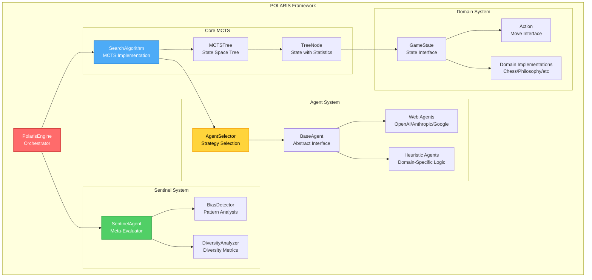
```mermaid
graph TB
    subgraph "POLARIS Framework"
        Engine[PolarisEngine<br/>Orchestrator]

        subgraph "Core MCTS"
            Search[SearchAlgorithm<br/>MCTS Implementation]
            Tree[MCTSTree<br/>State Space Tree]
            Node[TreeNode<br/>State with Statistics]
        end

        subgraph "Agent System"
            Selector[AgentSelector<br/>Strategy Selection]
            BaseAgent[BaseAgent<br/>Abstract Interface]
            WebAgents[Web Agents<br/>OpenAI/Anthropic/Google]
            HeuristicAgents[Heuristic Agents<br/>Domain-Specific Logic]
        end

        subgraph "Sentinel System"
            Sentinel[SentinelAgent<br/>Meta-Evaluator]
            BiasDetector[BiasDetector<br/>Pattern Analysis]
            DiversityAnalyzer[DiversityAnalyzer<br/>Diversity Metrics]
        end

        subgraph "Domain System"
            GameState[GameState<br/>State Interface]
            Action[Action<br/>Move Interface]
            Domains[Domain Implementations<br/>Chess/Philosophy/etc]
        end
    end

    Engine --> Search
    Engine --> Sentinel
    Search --> Tree
    Search --> Selector
    Tree --> Node
    Node --> GameState
    Selector --> BaseAgent
    BaseAgent --> WebAgents
    BaseAgent --> HeuristicAgents
    Sentinel --> BiasDetector
    Sentinel --> DiversityAnalyzer
    GameState --> Action
    GameState --> Domains

    style Engine fill:#ff6b6b,stroke:#c92a2a,color:#fff
    style Search fill:#4dabf7,stroke:#1971c2,color:#fff
    style Sentinel fill:#51cf66,stroke:#2f9e44,color:#fff
    style Selector fill:#ffd43b,stroke:#f59f00,color:#000
```

---

## Core Principles

### 1. Layered Cognitive Reasoning

Inspired by Daniel Kahneman's "Thinking, Fast and Slow", POLARIS organizes decision-making in hierarchical layers:

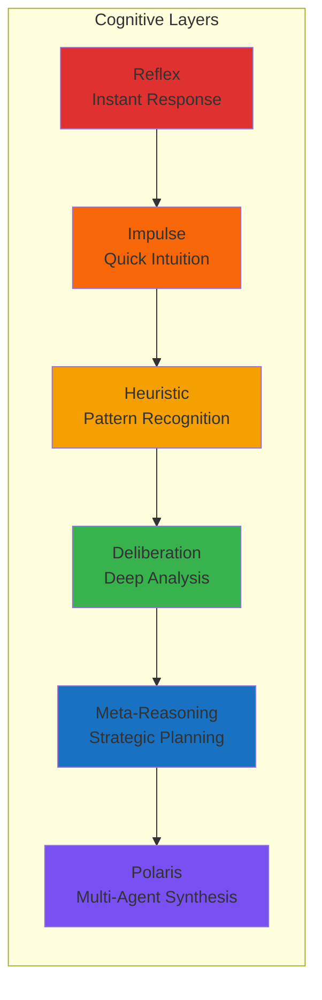
```mermaid
graph LR
    subgraph "Cognitive Layers"
        Reflex[Reflex<br/>Instant Response]
        Impulse[Impulse<br/>Quick Intuition]
        Heuristic[Heuristic<br/>Pattern Recognition]
        Deliberation[Deliberation<br/>Deep Analysis]
        MetaReasoning[Meta-Reasoning<br/>Strategic Planning]
        Polaris[Polaris<br/>Multi-Agent Synthesis]
    end

    Reflex --> Impulse
    Impulse --> Heuristic
    Heuristic --> Deliberation
    Deliberation --> MetaReasoning
    MetaReasoning --> Polaris

    style Reflex fill:#e03131
    style Impulse fill:#f76707
    style Heuristic fill:#f59f00
    style Deliberation fill:#37b24d
    style MetaReasoning fill:#1971c2
    style Polaris fill:#7950f2
```

### 2. Agent-Agnostic Design

POLARIS doesn't care about the implementation details of agents. Any system that can evaluate a state is valid:

- **Large Language Models** (GPT-4, Claude, Gemini)
- **Neural Networks** (AlphaZero-style networks)
- **Heuristic Functions** (Hand-crafted evaluation)
- **Hybrid Systems** (Combining multiple approaches)

### 3. Sentinel Oversight

Unlike traditional MCTS, POLARIS includes a **Sentinel Agent** that monitors the search process:

- Detects systematic, temporal, positional, and confirmation biases
- Analyzes evaluation diversity and groupthink
- Applies corrective adjustments to maintain search quality
- Provides transparency through intervention statistics

---

## System Architecture

### High-Level Component View

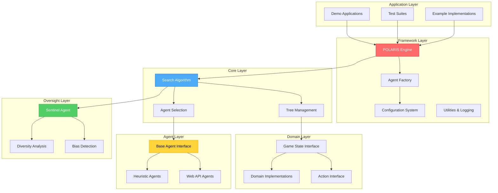
```mermaid
graph TB
    subgraph "Application Layer"
        Demo[Demo Applications]
        Tests[Test Suites]
        Examples[Example Implementations]
    end

    subgraph "Framework Layer"
        Engine[POLARIS Engine]
        Factory[Agent Factory]
        Config[Configuration System]
        Utils[Utilities & Logging]
    end

    subgraph "Core Layer"
        Search[Search Algorithm]
        Tree[Tree Management]
        Selection[Agent Selection]
    end

    subgraph "Agent Layer"
        AgentBase[Base Agent Interface]
        WebAPI[Web API Agents]
        Heuristic[Heuristic Agents]
    end

    subgraph "Oversight Layer"
        Sentinel[Sentinel Agent]
        Bias[Bias Detection]
        Diversity[Diversity Analysis]
    end

    subgraph "Domain Layer"
        StateBase[Game State Interface]
        ActionBase[Action Interface]
        DomainImpl[Domain Implementations]
    end

    Demo --> Engine
    Tests --> Engine
    Examples --> Engine
    Engine --> Factory
    Engine --> Search
    Factory --> Config
    Search --> Tree
    Search --> Selection
    Search --> Sentinel
    Selection --> AgentBase
    AgentBase --> WebAPI
    AgentBase --> Heuristic
    Sentinel --> Bias
    Sentinel --> Diversity
    Tree --> StateBase
    StateBase --> ActionBase
    StateBase --> DomainImpl

    style Engine fill:#ff6b6b,stroke:#c92a2a,color:#fff
    style Search fill:#4dabf7,stroke:#1971c2,color:#fff
    style Sentinel fill:#51cf66,stroke:#2f9e44,color:#fff
    style AgentBase fill:#ffd43b,stroke:#f59f00,color:#000
```

---

## Component Hierarchy

### POLARIS Engine (Orchestrator)

The main entry point that coordinates all framework components.

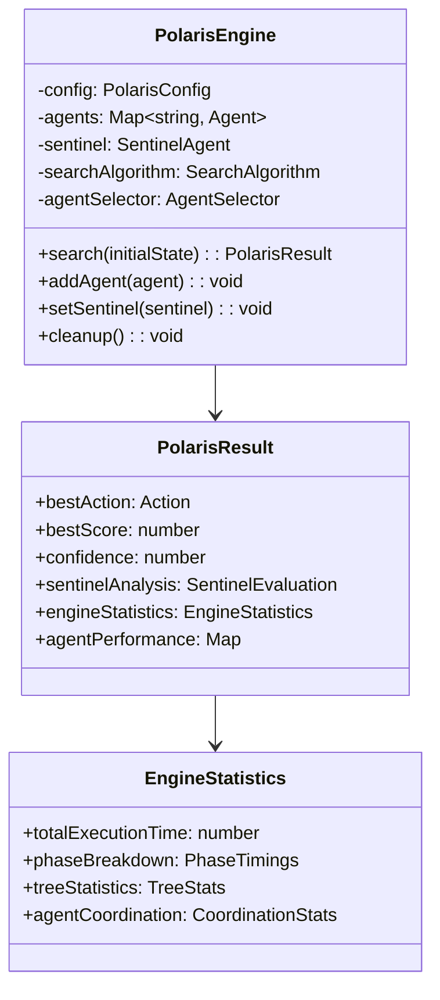
```mermaid
classDiagram
    class PolarisEngine {
        -config: PolarisConfig
        -agents: Map~string, Agent~
        -sentinel: SentinelAgent
        -searchAlgorithm: SearchAlgorithm
        -agentSelector: AgentSelector
        +search(initialState): PolarisResult
        +addAgent(agent): void
        +setSentinel(sentinel): void
        +cleanup(): void
    }

    class PolarisResult {
        +bestAction: Action
        +bestScore: number
        +confidence: number
        +sentinelAnalysis: SentinelEvaluation
        +engineStatistics: EngineStatistics
        +agentPerformance: Map
    }

    class EngineStatistics {
        +totalExecutionTime: number
        +phaseBreakdown: PhaseTimings
        +treeStatistics: TreeStats
        +agentCoordination: CoordinationStats
    }

    PolarisEngine --> PolarisResult
    PolarisResult --> EngineStatistics
```

### Search Algorithm (Core MCTS)

Implements the Monte Carlo Tree Search with agent diversity.

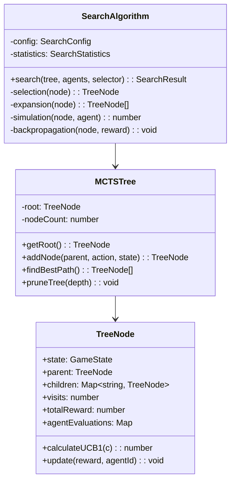
```mermaid
classDiagram
    class SearchAlgorithm {
        -config: SearchConfig
        -statistics: SearchStatistics
        +search(tree, agents, selector): SearchResult
        -selection(node): TreeNode
        -expansion(node): TreeNode[]
        -simulation(node, agent): number
        -backpropagation(node, reward): void
    }

    class MCTSTree {
        -root: TreeNode
        -nodeCount: number
        +getRoot(): TreeNode
        +addNode(parent, action, state): TreeNode
        +findBestPath(): TreeNode[]
        +pruneTree(depth): void
    }

    class TreeNode {
        +state: GameState
        +parent: TreeNode
        +children: Map~string, TreeNode~
        +visits: number
        +totalReward: number
        +agentEvaluations: Map
        +calculateUCB1(c): number
        +update(reward, agentId): void
    }

    SearchAlgorithm --> MCTSTree
    MCTSTree --> TreeNode
```

---

## Data Flow

### MCTS Iteration Flow

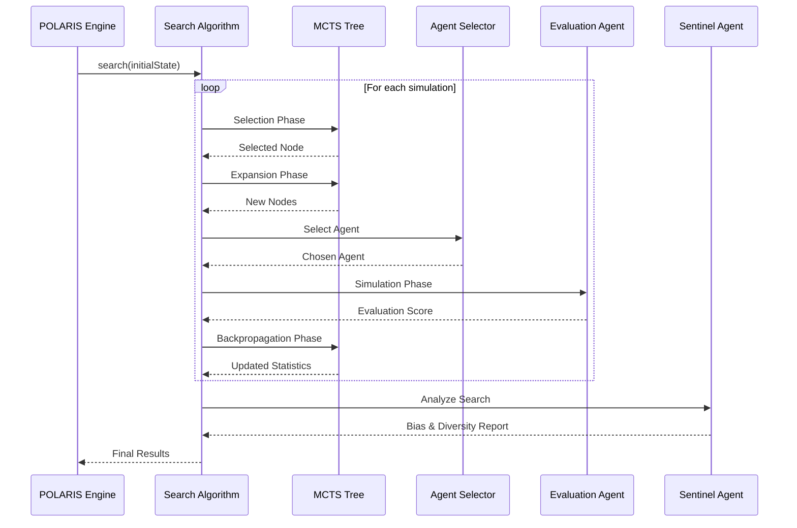
```mermaid
sequenceDiagram
    participant Engine as POLARIS Engine
    participant Search as Search Algorithm
    participant Tree as MCTS Tree
    participant Selector as Agent Selector
    participant Agent as Evaluation Agent
    participant Sentinel as Sentinel Agent

    Engine->>Search: search(initialState)

    loop For each simulation
        Search->>Tree: Selection Phase
        Tree-->>Search: Selected Node

        Search->>Tree: Expansion Phase
        Tree-->>Search: New Nodes

        Search->>Selector: Select Agent
        Selector-->>Search: Chosen Agent

        Search->>Agent: Simulation Phase
        Agent-->>Search: Evaluation Score

        Search->>Tree: Backpropagation Phase
        Tree-->>Search: Updated Statistics
    end

    Search->>Sentinel: Analyze Search
    Sentinel-->>Search: Bias & Diversity Report

    Search-->>Engine: Final Results
```

### Evaluation Flow with Sentinel

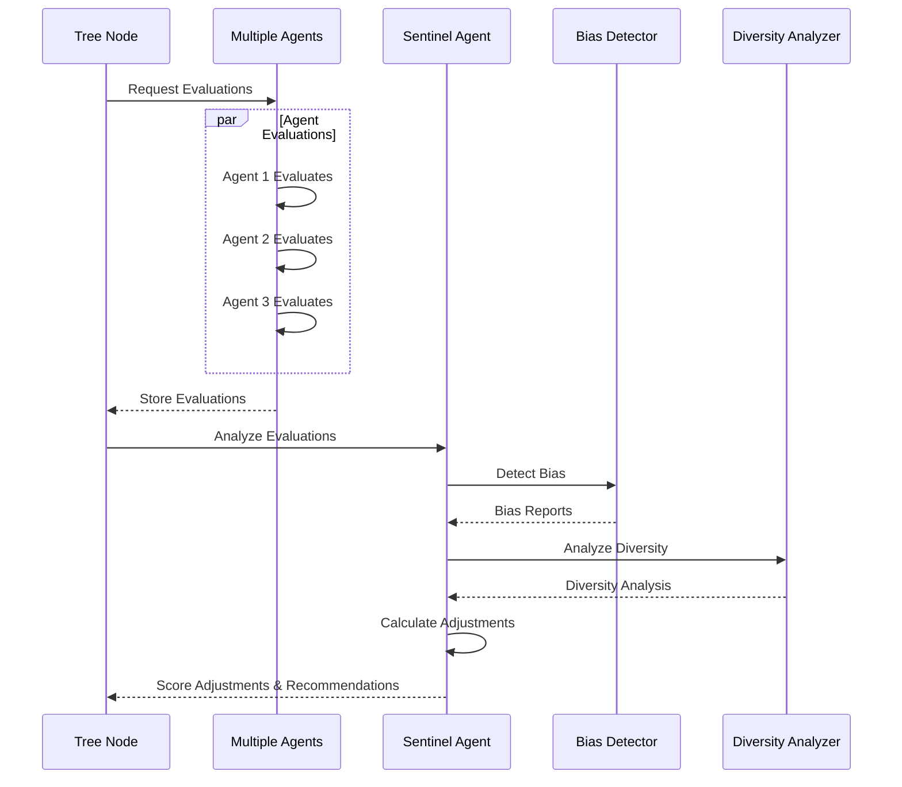
```mermaid
sequenceDiagram
    participant Node as Tree Node
    participant Agents as Multiple Agents
    participant Sentinel as Sentinel Agent
    participant Bias as Bias Detector
    participant Diversity as Diversity Analyzer

    Node->>Agents: Request Evaluations

    par Agent Evaluations
        Agents->>Agents: Agent 1 Evaluates
        Agents->>Agents: Agent 2 Evaluates
        Agents->>Agents: Agent 3 Evaluates
    end

    Agents-->>Node: Store Evaluations

    Node->>Sentinel: Analyze Evaluations

    Sentinel->>Bias: Detect Bias
    Bias-->>Sentinel: Bias Reports

    Sentinel->>Diversity: Analyze Diversity
    Diversity-->>Sentinel: Diversity Analysis

    Sentinel->>Sentinel: Calculate Adjustments
    Sentinel-->>Node: Score Adjustments & Recommendations
```

---

## Agent System

### Agent Hierarchy

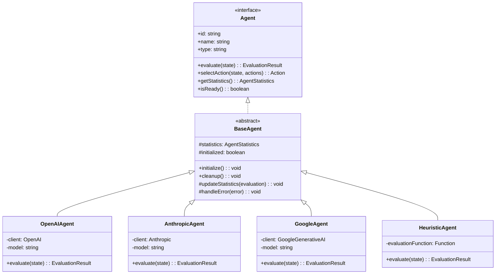
```mermaid
classDiagram
    class Agent {
        <<interface>>
        +id: string
        +name: string
        +type: string
        +evaluate(state): EvaluationResult
        +selectAction(state, actions): Action
        +getStatistics(): AgentStatistics
        +isReady(): boolean
    }

    class BaseAgent {
        <<abstract>>
        #statistics: AgentStatistics
        #initialized: boolean
        +initialize(): void
        +cleanup(): void
        #updateStatistics(evaluation): void
        #handleError(error): void
    }

    class OpenAIAgent {
        -client: OpenAI
        -model: string
        +evaluate(state): EvaluationResult
    }

    class AnthropicAgent {
        -client: Anthropic
        -model: string
        +evaluate(state): EvaluationResult
    }

    class GoogleAgent {
        -client: GoogleGenerativeAI
        -model: string
        +evaluate(state): EvaluationResult
    }

    class HeuristicAgent {
        -evaluationFunction: Function
        +evaluate(state): EvaluationResult
    }

    Agent <|.. BaseAgent
    BaseAgent <|-- OpenAIAgent
    BaseAgent <|-- AnthropicAgent
    BaseAgent <|-- GoogleAgent
    BaseAgent <|-- HeuristicAgent
```

### Agent Selection Strategies

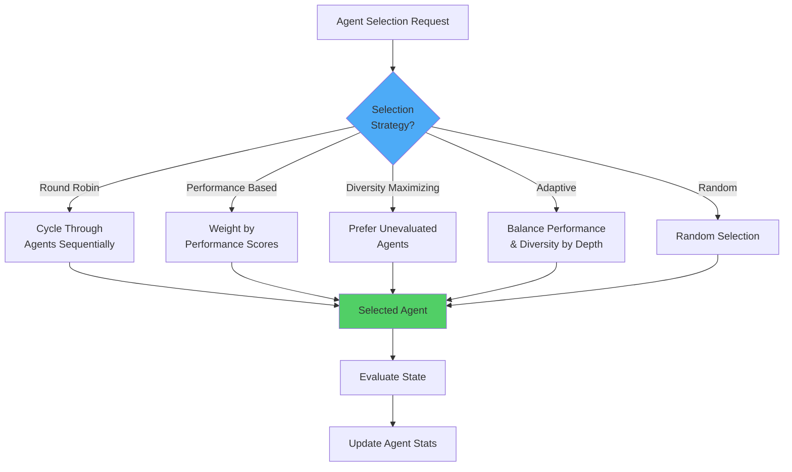
```mermaid
graph TD
    Start[Agent Selection Request]

    Start --> Strategy{Selection<br/>Strategy?}

    Strategy -->|Round Robin| RR[Cycle Through<br/>Agents Sequentially]
    Strategy -->|Performance Based| PB[Weight by<br/>Performance Scores]
    Strategy -->|Diversity Maximizing| DM[Prefer Unevaluated<br/>Agents]
    Strategy -->|Adaptive| AD[Balance Performance<br/>& Diversity by Depth]
    Strategy -->|Random| RND[Random Selection]

    RR --> Select[Selected Agent]
    PB --> Select
    DM --> Select
    AD --> Select
    RND --> Select

    Select --> Evaluate[Evaluate State]
    Evaluate --> Update[Update Agent Stats]

    style Strategy fill:#4dabf7
    style Select fill:#51cf66
```

---

## Sentinel Oversight

### Sentinel Agent Architecture

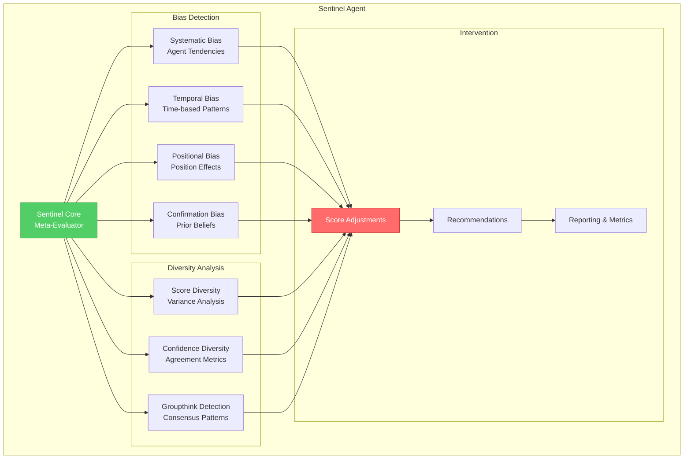
```mermaid
graph TB
    subgraph "Sentinel Agent"
        Core[Sentinel Core<br/>Meta-Evaluator]

        subgraph "Bias Detection"
            Systematic[Systematic Bias<br/>Agent Tendencies]
            Temporal[Temporal Bias<br/>Time-based Patterns]
            Positional[Positional Bias<br/>Position Effects]
            Confirmation[Confirmation Bias<br/>Prior Beliefs]
        end

        subgraph "Diversity Analysis"
            Score[Score Diversity<br/>Variance Analysis]
            Confidence[Confidence Diversity<br/>Agreement Metrics]
            Groupthink[Groupthink Detection<br/>Consensus Patterns]
        end

        subgraph "Intervention"
            Adjust[Score Adjustments]
            Recommend[Recommendations]
            Report[Reporting & Metrics]
        end
    end

    Core --> Systematic
    Core --> Temporal
    Core --> Positional
    Core --> Confirmation
    Core --> Score
    Core --> Confidence
    Core --> Groupthink

    Systematic --> Adjust
    Temporal --> Adjust
    Positional --> Adjust
    Confirmation --> Adjust
    Score --> Adjust
    Confidence --> Adjust
    Groupthink --> Adjust

    Adjust --> Recommend
    Recommend --> Report

    style Core fill:#51cf66,stroke:#2f9e44,color:#fff
    style Adjust fill:#ff6b6b,stroke:#c92a2a,color:#fff
```

### Bias Detection Pipeline

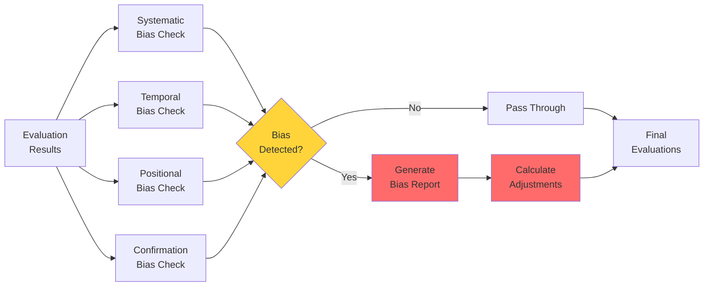
```mermaid
flowchart LR
    Input[Evaluation<br/>Results]

    Input --> Systematic[Systematic<br/>Bias Check]
    Input --> Temporal[Temporal<br/>Bias Check]
    Input --> Positional[Positional<br/>Bias Check]
    Input --> Confirmation[Confirmation<br/>Bias Check]

    Systematic --> Analyze{Bias<br/>Detected?}
    Temporal --> Analyze
    Positional --> Analyze
    Confirmation --> Analyze

    Analyze -->|Yes| Report[Generate<br/>Bias Report]
    Analyze -->|No| Pass[Pass Through]

    Report --> Adjust[Calculate<br/>Adjustments]
    Pass --> Output[Final<br/>Evaluations]
    Adjust --> Output

    style Analyze fill:#ffd43b
    style Report fill:#ff6b6b
    style Adjust fill:#ff6b6b
```

---

## Domain System

### Domain Interface Structure

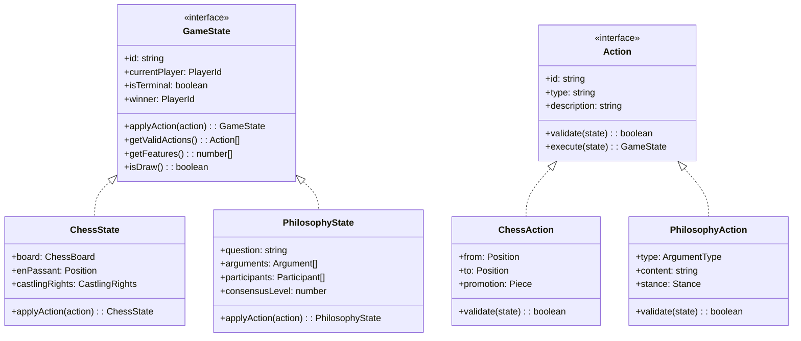
```mermaid
classDiagram
    class GameState {
        <<interface>>
        +id: string
        +currentPlayer: PlayerId
        +isTerminal: boolean
        +winner: PlayerId
        +applyAction(action): GameState
        +getValidActions(): Action[]
        +getFeatures(): number[]
        +isDraw(): boolean
    }

    class Action {
        <<interface>>
        +id: string
        +type: string
        +description: string
        +validate(state): boolean
        +execute(state): GameState
    }

    class ChessState {
        +board: ChessBoard
        +enPassant: Position
        +castlingRights: CastlingRights
        +applyAction(action): ChessState
    }

    class ChessAction {
        +from: Position
        +to: Position
        +promotion: Piece
        +validate(state): boolean
    }

    class PhilosophyState {
        +question: string
        +arguments: Argument[]
        +participants: Participant[]
        +consensusLevel: number
        +applyAction(action): PhilosophyState
    }

    class PhilosophyAction {
        +type: ArgumentType
        +content: string
        +stance: Stance
        +validate(state): boolean
    }

    GameState <|.. ChessState
    GameState <|.. PhilosophyState
    Action <|.. ChessAction
    Action <|.. PhilosophyAction
```

### Domain-Agnostic Design

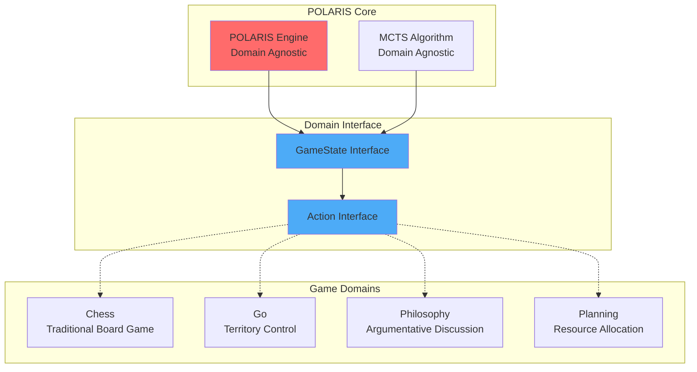
```mermaid
graph TB
    subgraph "POLARIS Core"
        Engine[POLARIS Engine<br/>Domain Agnostic]
        Search[MCTS Algorithm<br/>Domain Agnostic]
    end

    subgraph "Domain Interface"
        GameState[GameState Interface]
        Action[Action Interface]
    end

    subgraph "Game Domains"
        Chess[Chess<br/>Traditional Board Game]
        Go[Go<br/>Territory Control]
        Philosophy[Philosophy<br/>Argumentative Discussion]
        Planning[Planning<br/>Resource Allocation]
    end

    Engine --> GameState
    Search --> GameState
    GameState --> Action

    Action -.-> Chess
    Action -.-> Go
    Action -.-> Philosophy
    Action -.-> Planning

    style Engine fill:#ff6b6b
    style GameState fill:#4dabf7
    style Action fill:#4dabf7
```

---

## Search Process

### Complete MCTS Cycle

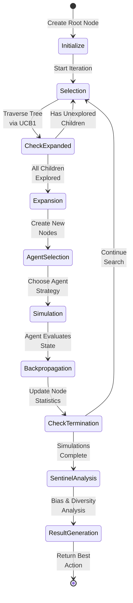
```mermaid
stateDiagram-v2
    [*] --> Initialize: Create Root Node

    Initialize --> Selection: Start Iteration

    Selection --> CheckExpanded: Traverse Tree<br/>via UCB1

    CheckExpanded --> Selection: Has Unexplored<br/>Children
    CheckExpanded --> Expansion: All Children<br/>Explored

    Expansion --> AgentSelection: Create New<br/>Nodes

    AgentSelection --> Simulation: Choose Agent<br/>Strategy

    Simulation --> Backpropagation: Agent Evaluates<br/>State

    Backpropagation --> CheckTermination: Update Node<br/>Statistics

    CheckTermination --> Selection: Continue<br/>Search
    CheckTermination --> SentinelAnalysis: Simulations<br/>Complete

    SentinelAnalysis --> ResultGeneration: Bias & Diversity<br/>Analysis

    ResultGeneration --> [*]: Return Best<br/>Action
```

### UCB1 Calculation Flow

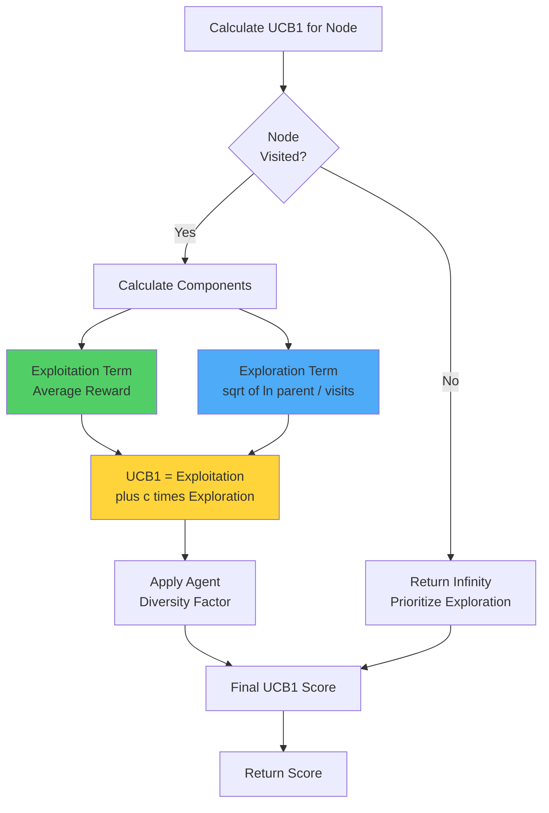
```mermaid
flowchart TB
    Start[Calculate UCB1 for Node]

    Start --> CheckVisits{Node<br/>Visited?}

    CheckVisits -->|No| MaxValue[Return Infinity<br/>Prioritize Exploration]
    CheckVisits -->|Yes| Calculate[Calculate Components]

    Calculate --> Exploit[Exploitation Term<br/>Average Reward]
    Calculate --> Explore[Exploration Term<br/>sqrt of ln parent / visits]

    Exploit --> Combine[UCB1 = Exploitation<br/>plus c times Exploration]
    Explore --> Combine

    Combine --> AgentDiversity[Apply Agent<br/>Diversity Factor]

    AgentDiversity --> Result[Final UCB1 Score]

    MaxValue --> Result
    Result --> End[Return Score]

    style Exploit fill:#51cf66
    style Explore fill:#4dabf7
    style Combine fill:#ffd43b
```

---

## Design Patterns

### 1. Strategy Pattern (Agent Selection)

Different strategies for selecting which agent to use:

- **Round Robin**: Fair distribution
- **Performance-Based**: Weighted by quality
- **Diversity-Maximizing**: Avoid redundancy
- **Adaptive**: Context-dependent selection

### 2. Observer Pattern (Sentinel System)

The Sentinel observes evaluations and intervenes when necessary:

- Monitors all agent evaluations
- Detects patterns and anomalies
- Provides feedback without blocking
- Maintains history for trend analysis

### 3. Template Method Pattern (Agent Base)

Common agent lifecycle with customizable evaluation:

```typescript
abstract class BaseAgent {
  async evaluate(state: GameState): EvaluationResult {
    // Template method with hooks
    this.beforeEvaluate();
    const result = await this.doEvaluate(state); // Abstract
    this.afterEvaluate(result);
    return result;
  }

  protected abstract doEvaluate(state: GameState): EvaluationResult;
}
```

### 4. Builder Pattern (Configuration)

Fluent configuration building:

```typescript
const config = new ConfigBuilder()
  .withSearch({ simulationsPerNode: 1000 })
  .withSentinel({ diversityThreshold: 0.7 })
  .withAgents([agent1, agent2, agent3])
  .build();
```

### 5. Factory Pattern (Agent Creation)

Centralized agent instantiation:

```typescript
const agent = AgentFactory.create("openai", {
  apiKey: process.env.OPENAI_API_KEY,
  model: "gpt-4",
});
```

---

## Key Features

### 1. Multi-Agent Diversity

- **Parallel Reasoning**: Multiple agents evaluate simultaneously
- **Bias Mitigation**: Diverse perspectives reduce systematic errors
- **Consensus Building**: Aggregated opinions improve reliability

### 2. Meta-Cognitive Oversight

- **Bias Detection**: Identifies systematic evaluation patterns
- **Diversity Analysis**: Measures evaluation variance
- **Corrective Intervention**: Adjusts scores to maintain quality

### 3. Domain Flexibility

- **Game AI**: Chess, Go, strategic games
- **Planning**: Resource allocation, scheduling
- **Discussion**: Philosophical debates, consensus-building
- **Research**: Multi-perspective analysis

### 4. Production-Ready Features

- **Error Handling**: Graceful degradation and recovery
- **Performance Monitoring**: Detailed statistics and profiling
- **Memory Management**: Tree pruning and resource limits
- **Logging & Debugging**: Comprehensive instrumentation

---

## Performance Characteristics

### Complexity Analysis

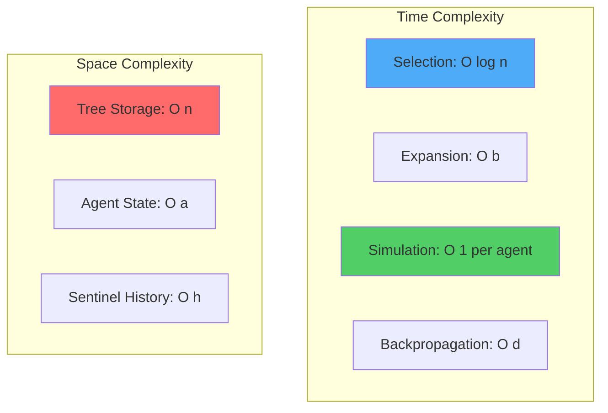
```mermaid
graph TB
    subgraph TimeComplexity["Time Complexity"]
        Selection[Selection: O log n]
        Expansion[Expansion: O b]
        Simulation[Simulation: O 1 per agent]
        Backprop[Backpropagation: O d]
    end

    subgraph SpaceComplexity["Space Complexity"]
        Tree[Tree Storage: O n]
        Agents[Agent State: O a]
        History[Sentinel History: O h]
    end

    style Selection fill:#4dabf7
    style Simulation fill:#51cf66
    style Tree fill:#ff6b6b
```

- **n**: Number of nodes in tree
- **b**: Branching factor (actions per state)
- **d**: Depth of tree
- **a**: Number of agents
- **h**: History size for sentinel### Scalability Factors

1. **Horizontal Scaling**: Multiple agents can evaluate in parallel
2. **Vertical Scaling**: Tree pruning and progressive widening
3. **Time Management**: Early termination and time limits
4. **Memory Management**: Automatic pruning under pressure

---

## Future Extensions

### Planned Features

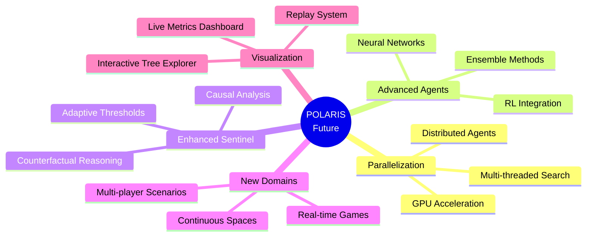
```mermaid
mindmap
  root((POLARIS<br/>Future))
    Parallelization
      Multi-threaded Search
      Distributed Agents
      GPU Acceleration
    Advanced Agents
      RL Integration
      Neural Networks
      Ensemble Methods
    Enhanced Sentinel
      Causal Analysis
      Counterfactual Reasoning
      Adaptive Thresholds
    New Domains
      Real-time Games
      Continuous Spaces
      Multi-player Scenarios
    Visualization
      Interactive Tree Explorer
      Live Metrics Dashboard
      Replay System
```

---

## Conclusion

POLARIS represents a novel approach to decision-making that:

1. **Embraces Diversity**: Multiple agents with different biases create robust evaluations
2. **Provides Oversight**: Sentinel system ensures quality and transparency
3. **Enables Flexibility**: Domain-agnostic design works across problem spaces
4. **Scales Effectively**: Production-ready features support real-world applications

The framework is built on solid software engineering principles while implementing cutting-edge AI research concepts, making it both practical and innovative.

---

## References

- Kahneman, D. (2011). _Thinking, Fast and Slow_
- Browne, C. et al. (2012). "A Survey of Monte Carlo Tree Search Methods"
- Silver, D. et al. (2017). "Mastering Chess and Shogi by Self-Play with a General Reinforcement Learning Algorithm"

---

_For more information, see [README.md](README.md) and [PHILOSOPHY_DEMO.md](PHILOSOPHY_DEMO.md)_
