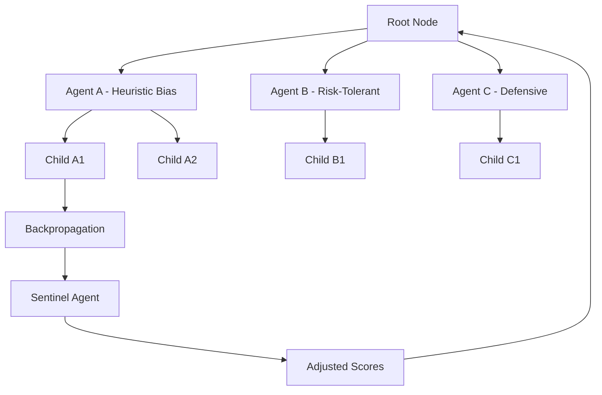

# POLARIS

**POLARIS** (Policy Optimization via Layered Agents and Recursive Inference Search) is a novel decision-making framework designed to simulate parallel lines of reasoning across agents with varied internal parameters. It extends Monte Carlo Tree Search (MCTS) by embedding agent diversity at each node and introducing a meta-evaluator called the **Sentinel Agent**, which provides external, corrective insight during the backpropagation phase.

  

---

## Key Concepts

### Layered Cognitive Reasoning

Inspired by Daniel Kahneman’s *Thinking, Fast and Slow*, POLARIS organizes decision-making in layers:

_Reflex < Impulse < Heuristic < Deliberation < Meta-Reasoning < Polaris_

This layered framework mirrors the spectrum of cognition—from the instinctual responses of System 1 to the methodical analysis of System 2—and then goes a step further. POLARIS does not merely alternate between fast and slow thinking; it *orchestrates* them. By embedding a variety of agents at each node—ranging from reactive evaluators to symbolic reasoners or large language models—POLARIS constructs a collaborative battlefield of perspectives.

This is where the innovation lies: instead of choosing the best single model, POLARIS creates an ecosystem of thought. Each simulation is not just a roll of the dice, but a simulated debate, with the **Sentinel Agent** acting as a moderator who watches the entire tree, evaluates diversity, coherence, and surprise, and selectively reinforces strategies that reflect strategic adaptability and long-term insight.

This approach is not just scalable. It's epistemologically *layered*.

Each POLARIS node represents a snapshot of deliberation made by an agent with slightly different internal reasoning biases, allowing for a rich landscape of possible outcomes to be explored.

---

## Architecture Overview

---

## Sentinel Agent

The Sentinel Agent acts as a meta-observer during search. Its role is to:

Analyze children of a node before backpropagation.

Detect bias, lack of diversity, or contradictory moves.

Apply corrections based on heuristics, global knowledge, or LLMs.

This makes POLARIS highly adaptable in open domains or when decisions involve multi-objective trade-offs.

---

## Why Polaris?

Parallel Reasoning: Simulates multiple styles of thought.

Strategic Exploration: Embraces diversity without degeneracy.

Meta-Cognitive Oversight: Backpropagation is enriched by layered insight.

General-Purpose: Applicable beyond chess to planning, games, agent systems, etc.

---

## Future Directions

Apply to domains like narrative planning, autonomous navigation, or adversarial games.

Combine with reinforcement learning for adaptive agent parameter tuning.

---

## Copyright

© 2025 Diego Vallejo. All rights reserved.

This project is licensed under the [MIT License](https://opensource.org/licenses/MIT).

You are free to use, modify, and distribute this software in personal and commercial projects, provided that proper attribution is maintained. POLARIS is a trademark of Diego Vallejo and may not be used for derivative branding or commercial services without explicit permission.
